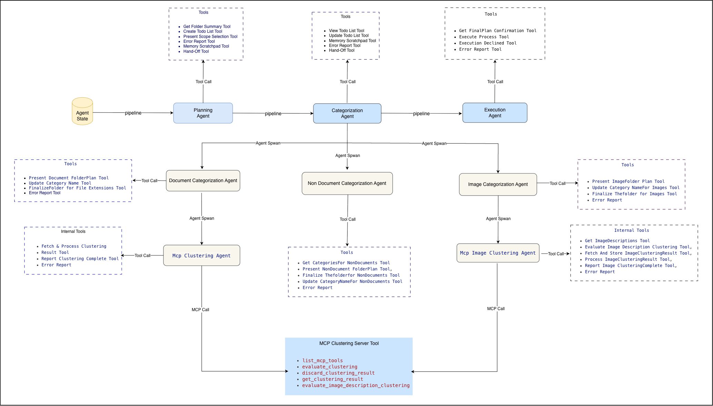

<div align="center">

# File Organization Agent

### A Complex Agentic Workflow — Powered by a Small Language Model

**Proof that you don't need a massive frontier model to build sophisticated AI agents.**

[](https://www.typescriptlang.org/)
[](https://www.electronjs.org/)
[](https://www.python.org/)
[](https://maartengr.github.io/BERTopic/)
[](https://huggingface.co/unsloth/Ministral-3-8B-Reasoning-2512-GGUF)
[](LICENSE)

</div>

---

## The Core Idea

In an era dominated by large frontier models, this project asks a different question:

> **What if we could build a complex, multi-step agentic workflow using only a small, locally-running 3B–8B language model?**

The answer is: **yes — if you respect the model's limits and design around them.**

Small models fail not because they lack intelligence, but because they get overwhelmed. Give a small model a massive task with a bloated context and 20 tools at once, and it spirals into a "reasoning hell" — looping, hallucinating, or freezing. The solution is **divide and conquer**: cut the big task into small, focused sub-problems and assign each to a dedicated agent with a minimal toolset and a single, crystal-clear job.

This project is a desktop **AI-powered file organizer** built on this philosophy. It uses `unsloth/Ministral-3-8B-Reasoning-2512-GGUF`, served locally via `llama.cpp`, with **no cloud API calls whatsoever**. Every token stays on your machine.

---

## System Architecture



The pipeline is a **sequential multi-agent system** with three primary stages and three categorization sub-agents, each communicating through a shared state object — not through message passing. Below is the full picture.

---

## Architecture Overview

This is a **monorepo** with two distinct applications:

| Application | Stack | Role |
|-------------|-------|------|
| **Main App** | Electron + Node.js + TypeScript + React | Desktop UI, LLM orchestration, agent pipeline |
| **MCP Server** (`file-organizer-mcp/`) | Python + FastMCP + BERTopic | Semantic clustering engine |

---

## The Agent Pipeline — Three Stages

The top-level orchestrator (`src/agent.ts`) sequences three stages in order. It never calls the LLM itself — it just wires the stages together, detects sentinel signals, and decides whether to proceed or abort.

```
User Input ──► Planning Agent ──► Categorization Agent ──► Execution Agent
```

Each stage runs inside an **`OpenAISession`** (`src/workerAgent.ts`) — the core LLM loop engine that:
- Maintains a growing `messages[]` conversation array
- Dispatches tool calls in a `while(true)` loop
- Enforces tool use: if the model replies with plain text instead of a tool call, it auto-injects a corrective message and retries up to 3 times
- Detects **sentinel strings** from tool handlers to break out of stages cleanly

---

### Stage 1 — Planning Agent

**Single job:** Understand the workspace, let the user pick what to organize, build a task list, hand off.

| Tool | What It Does |
|------|-------------|
| `GetFolderSummaryTool` | Scans the folder; categorizes extensions into `documents`, `images`, `non-documents`; skips temp/lock files (`.DS_Store`, `~$*`, `.swp`, etc.) |
| `PresentScopeSelectionTool` | Renders a checklist UI to the renderer via Electron IPC; **blocks until the user responds** |
| `CreateTodoListTool` | Writes the structured task list to shared state |
| `ViewTodoListTool` | Reads the task list back for verification |
| `UpdateTodoListTool` | Modifies task statuses |
| `MemoryScratchpadTool` | Lightweight per-session scratchpad for agent notes |
| `HandOffToCategorizationAgent` | Returns `__HANDOFF_CATEGORIZATION__` sentinel → advances pipeline |
| `ErrorEncountered` | Returns `__ERROR_ENCOUNTERED__` sentinel → aborts pipeline |

**Key rules enforced by the system prompt:**
- Every response MUST be a tool call — plain text is never allowed
- The task list is built strictly from what `PresentScopeSelectionTool` returns — the model never reconstructs it from memory
- The agent never calls worker agents or asks the user about naming conventions

---

### Stage 2 — Categorization Agent (Task Orchestrator)

**Single job:** Read the todo list, dispatch the right sub-agent for each task, track statuses, hand off.

| Tool | What It Does |
|------|-------------|
| `ViewTodoListTool` | Read the task list |
| `UpdateTodoListTool` | Mark tasks `in-progress` / `completed` / `failed` |
| `MemoryScratchpadTool` | Access notes recorded during planning |
| `DocumentCategorizationAgent` | Spawns a document worker sub-agent for one task |
| `NonDocumentCategorizationAgent` | Spawns a non-document worker sub-agent for one task |
| `ImageCategorizationAgent` | Spawns an image worker sub-agent for one task |
| `HandOffToExecutionAgent` | Returns `__HANDOFF_EXECUTION__` sentinel → advances pipeline |
| `ErrorEncountered` | Aborts pipeline |

This agent loops through the todo list in order. For each task it:
1. Marks the task `in-progress`
2. Dispatches the correct sub-agent (a full nested `OpenAISession`)
3. Marks the task `completed` or `failed`
4. Hands off when all tasks are done

---

### Stage 3 — Execution Agent

**Single job:** Show the final plan, confirm with user, move the files. Intentionally the simplest stage.

| Tool | What It Does |
|------|-------------|
| `getFinalPlanConfirmation` | Renders the complete movement plan in the UI; blocks until user responds |
| `Executetheprocess` | Creates folders and physically moves files |
| `ExecutionDeclined` | Clean abort on user decline |
| `ErrorEncountered` | Error abort |

---

## The Categorization Sub-Agents

Each sub-agent is a full nested `OpenAISession` with its own system prompt and toolset — a mini-pipeline within the main pipeline.

### Document Categorization Agent

Handles document extensions (`.pdf`, `.docx`, `.txt`, `.epub`, `.xlsx`, etc.) — **one session per file type**.

```
McpClusteringAgent → PresentDocumentFolderPlanTool → [rename/merge loop] → Finalize
```

**Tool set:**

```
McpClusteringAgent                            ← spawns MCP clustering sub-agent
PresentDocumentFolderPlanTool                 ← shows plan, waits for user
UpdateCategoryNameTool                        ← renames/merges categories
FinalizeThefolderforthefilesforEachExtensions ← writes plan to state
ErrorEncountered
```

`McpClusteringAgent` is itself another nested sub-agent (`mcpClusteringAgentSystemPrompt`) that:
- Calls `evaluate_clustering` on the MCP server (up to 3 times with different strategies)
- Evaluates compact quality metrics — rating, score, topic previews, outlier ratio, cohesion
- Discards rejected runs
- Calls `FetchAndProcessClusteringResultTool` which internally runs the **Topic Name Suggestion Agent** (see below)
- Reports completion with a compact summary

---

### Image Categorization Agent

Handles image files (`.jpg`, `.png`, `.webp`, `.gif`, `.svg`, etc.) — uses **vision + semantic clustering**.

```
McpImageClusteringAgent → PresentImageFolderPlanTool → [rename/merge loop] → Finalize
```

**Tool set:**

```
McpImageClusteringAgent              ← spawns MCP image clustering sub-agent
PresentImageFolderPlanTool           ← shows plan, waits for user
UpdateCategoryNameForImagesTool      ← renames/merges categories
FinalizeThefolderforImages           ← writes plan to state
ErrorEncountered
```

`McpImageClusteringAgent` is a nested sub-agent that orchestrates:

1. `GetImageDescriptionsTool` — calls the LLM **vision API** for every image; generates a 20–4,000 character description per image. Descriptions are stored in-process state — never returned to the sub-agent to preserve context space.
2. `EvaluateImageDescriptionClusteringTool` — sends stored descriptions to the MCP server for BERTopic clustering (same strategy/retry logic as documents).
3. `FetchAndStoreImageClusteringResultTool` — retrieves the full result.
4. `ProcessImageClusteringResultTool` — names topics via LLM, deduplicates categories, writes folder plan.
5. `ReportImageClusteringCompleteTool` — signals parent agent.

---

### Non-Document Categorization Agent

Handles everything else: videos, archives, audio, executables, scripts, etc. — **no BERTopic needed**.

```
GetCategoriesForNonDocuments → PresentNonDocumentFolderPlanTool → [rename/merge loop] → Finalize
```

**Tool set:**

```
GetCategoriesForNonDocuments             ← two-tier categorization (map + LLM)
PresentNonDocumentFolderPlanTool         ← shows plan, waits for user
UpdateCategoryNameForNonDocumentsTool    ← renames/merges categories
FinalizeThefolderforNonDocuments         ← writes plan to state
ErrorEncountered
```

`GetCategoriesForNonDocuments` uses a deliberate **two-tier approach**:
1. **Deterministic lookup first** — a pre-built static map (`extensionCategoryMap.ts`) handles common extensions with zero LLM cost.
2. **LLM fallback for unknowns only** — only unrecognized extensions go to the model, using a strict `json_schema` response format at `temperature: 0.1`.

---

## Single-Scope LLM Agents Inside Tool Handlers

A key innovation of this architecture is that even **tool handlers themselves** contain small, focused LLM calls for atomic subtasks. These are not agentic loops — they are direct `chat.completions.create()` calls with a single, well-defined job.

### Topic Name Suggestion Agent

**Where:** `fileClassificationTool.ts` → `nameTopicsFromMcpResponse`  
**When:** After BERTopic returns a clustering result, once per topic cluster.

- Receives **c-TF-IDF keywords** (ranked by distinctiveness) and up to 4 representative files tagged by cluster position: `[Core]`, `[Mid-1]`, `[Edge]`
- Uses `fileCategorizationPrompt` as the system prompt — a folder-naming expert
- Settings: `temperature: 0.2`, `max_tokens: 1800`, `repeat_penalty: 1.1`
- The model reasons freely in `<think>` or free text, then emits the answer inside `<output>...</output>` tags

**Why `<output>` tags instead of JSON schema?**  
Forcing `json_schema` makes the model commit to an answer token immediately — with no room to think first. For a nuanced naming task (identifying the semantic domain, detecting mixed clusters), the model needs its full reasoning trace. Free-form + `<output>` tags consistently produces better, more descriptive folder names.

### Topic Name Repair Agent

**Where:** `classificationUtility.ts` → `repairTaggedOutput`  
**When:** When the Topic Name Suggestion Agent forgets to close its `<output>` tag (a common small-model failure).

- Feeds the incomplete output back with a terse extraction instruction
- Settings: `temperature: 0`, `max_tokens: 60` (extraction only, not reasoning), `repeat_penalty: 1.1`
- Returns `null` if repair fails; callers fall back to `Category_N`

### Topic Name Deduplication Agent

**Where:** `classificationUtility.ts` → `deduplicateCategories`  
**When:** After all topics are named, to merge semantically similar categories (e.g., `Tax_Documents` + `Taxes`).

The challenge: small models lose accuracy over long, open-ended lists in a single prompt. The solution:

- **Chunked processing** — splits the full category list into chunks of **9 names** each
- **Per-chunk LLM call** with `dedupCategoryPrompt` — a taxonomy engine prompt that returns `{"merges": [{"source", "target"}]}` JSON
- Settings: `temperature: 0.2`, `max_tokens: 800`, `repeat_penalty: 1.3`
- **Multi-pass** — runs up to 2 passes to catch cross-chunk duplicates that emerge after the first merge round
- Stops early when no merges are produced or the list fits in a single chunk

This runs for **both document and image** categorization after topic naming.

---

## The MCP Server — `file-organizer-mcp`

A standalone **Python FastMCP server** (Streamable HTTP via `uvicorn`) that owns the full semantic clustering pipeline.

### Exposed MCP Tools

| Tool | Description |
|------|-------------|
| `evaluate_clustering` | Runs BERTopic on a folder of documents. Returns **compact quality metrics + `run_id`** — never the full file list. Safe to call up to 3 times. |
| `get_clustering_result` | Retrieves the full stored result for a `run_id`: file assignments, c-TF-IDF terms, probabilities, outliers. |
| `evaluate_image_description_clustering` | Clusters caller-provided text descriptions (no file access). Images stay on the client. |
| `discard_clustering_result` | Removes a rejected run from the in-memory store. |

### BERTopic Pipeline

```
Files → Text Extraction → Embedding (nomic-embed-text) → UMAP → HDBSCAN → c-TF-IDF → Quality Evaluation
```

1. **File Discovery** — validates paths, finds files by extension
2. **Text Extraction** — per-format extractors: PDF, DOCX, PPTX, XLSX, EPUB, HTML, MD
3. **Embedding** — `nomic-embed-text-v1.5.Q6_K.gguf` via `llama-cpp-python`. Embeddings are **hash-cached** per file — repeated runs skip re-embedding unchanged files.
4. **UMAP** — dimensionality reduction
5. **HDBSCAN** — density-based clustering (outliers become the `Uncategorized` group)
6. **c-TF-IDF** — extracts per-topic distinctive keywords for the naming agents
7. **Quality Evaluation** — structured concern codes: `TOO_FEW_TOPICS`, `HIGH_OUTLIER_RATIO`, `LOW_COHESION`, `DOMINANT_TOPIC`
8. **Strategy Tuning** (`tuning.py`) — maps strategy names to bounded UMAP/HDBSCAN configs. The LLM agent picks the strategy; the server applies safe overrides.

### Design Decisions

- **No file movement ever happens in the MCP server** — it only analyzes. The Node.js execution agent moves files.
- **Single `uvicorn` worker** — BERTopic/HDBSCAN is not thread-safe. A `SequentialJobQueue` serializes all clustering requests.
- **Two-step result access** — `evaluate_clustering` returns compact metrics (safe for LLM context). `get_clustering_result` returns the full data, but is called *inside* a Node.js tool handler — the raw file list never enters the LLM's context window.

---

## Shared State — The Single Source of Truth

All agents in the pipeline read from and write to a single `fileAgentState` instance, keyed by `processId` (a UUID) in the global `fileAgentRecord`. This is why agents don't need to pass data through their tool arguments — and why the LLM's context window stays small.

```typescript
class fileAgentState {
    workspacePath: string          // root folder
    fileListData: fileStatus[]     // all discovered files
    fileByExtension: Record<string, fileStatus[]>
    categorySummary: CategorySummary          // {documents, images, non-documents}
    todoList: TodoItem[]           // the plan
    globalNotes: string[]          // agent scratchpad
    proposedFolderPlan: Record<string, FolderPlanEntry[]>  // the categorization result
    mcpClusterResults: Record<string, any>   // raw MCP results between two-step calls
    phase: 'planning' | 'categorization' | 'execution' | 'done'
}
```

---

## Architecture Evolution

This project went through a significant architectural shift:

**v1 (deprecated):** All clustering ran in the Node.js process. The `EmbeddingService` loaded `nomic-embed-text-v1.5.Q6_K.gguf` via `node-llama-cpp`, embedded documents and images in-process, then spawned a Python child process (`scripts/clusterV3.py`) over stdin/stdout to run HDBSCAN. Results came back via JSON. This worked but had limitations in performance, clustering quality, and tight runtime coupling.

**v2 (current):** All clustering is delegated to the dedicated `file-organizer-mcp` Python MCP server. Both document and image categorization call the MCP server over HTTP. The Node.js app manages agent orchestration and user interaction; the Python server owns semantic understanding. This separation enables independent scaling, testing, and improvement of the clustering engine.

The deprecated `EmbeddingService.ts` and `ClassificationUtility.clusterEmbeddings()` are preserved in the codebase for historical reference.

---

## Technology Stack

### Main Application (Node.js + Electron)

| Layer | Technology |
|-------|-----------|
| Desktop shell | Electron 37 |
| UI framework | React 19 + Vite |
| Language | TypeScript 6 |
| LLM inference | `llama.cpp` HTTP server (OpenAI-compatible API) |
| LLM SDK | `openai` v6 + `@openai/agents` |
| MCP client | `@modelcontextprotocol/sdk` |
| Document parsing | `pdf-parse`, `mammoth`, `officeparser`, `epub2`, `xlsx` |
| Image processing | `sharp` |

### MCP Clustering Server (Python)

| Layer | Technology |
|-------|-----------|
| Server framework | FastMCP + uvicorn (Streamable HTTP) |
| Language | Python 3.11+ |
| Topic modeling | BERTopic 0.17 |
| Dimensionality reduction | UMAP |
| Clustering | HDBSCAN |
| Embeddings | `nomic-embed-text-v1.5.Q6_K.gguf` via `llama-cpp-python` |
| Document parsing | `pypdf`, `python-docx`, `python-pptx`, `openpyxl`, `EbookLib`, `BeautifulSoup4` |
| Validation | Pydantic v2 |

### The Model

| Role | Model |
|------|-------|
| **LLM (reasoning + tool use + vision)** | `unsloth/Ministral-3-8B-Reasoning-2512-GGUF` |
| **Served via** | `llama.cpp` HTTP server at `http://localhost:8080` |
| **Embedding (clustering)** | `nomic-embed-text-v1.5.Q6_K.gguf` (inside the Python MCP server) |

---

## Repository Structure

```
assist/
├── src/
│   ├── agent.ts                        ← Top-level pipeline orchestrator (FileAgent)
│   ├── workerAgent.ts                  ← OpenAISession — the core LLM loop engine
│   ├── LLMService.ts                   ← Singleton OpenAI client → local llama.cpp
│   ├── EmbeddingService.ts             ← [DEPRECATED] In-process embedding, replaced by MCP
│   ├── ApiConfig.ts                    ← LLM server endpoint config
│   ├── prompt/
│   │   └── fileAgent.ts                ← All system prompts for all agents
│   ├── state/
│   │   └── fileAgentState.ts           ← Shared pipeline state (single source of truth)
│   ├── services/
│   │   └── McpClientService.ts         ← HTTP client for the MCP server
│   └── utils/
│       └── classificationUtility.ts    ← deduplicateCategories, extractTaggedOutput, repairTaggedOutput
│
├── tools/
│   ├── planningAgentTools.ts           ← Planning Agent tool implementations
│   ├── categorizationAgentTools.ts     ← Categorization Agent tool implementations
│   ├── executionAgentTools.ts          ← Execution Agent tool implementations
│   ├── fileCategorizationTools.ts      ← Document sub-agent tools (MCP clustering path)
│   ├── mcpClusteringAgentTools.ts      ← MCP clustering sub-agent tools (documents)
│   ├── mcpImageClusteringAgentTools.ts ← MCP image clustering sub-agent tools
│   ├── imageClassificationTool.ts      ← Image worker (vision description + old embedding path)
│   ├── fileClassificationTool.ts       ← Topic naming + deduplication agent implementations
│   └── pipelineTools.ts                ← HandOff sentinels + ErrorEncountered
│
├── electron/
│   └── ipcBridge.ts                    ← Electron IPC — real-time UI updates
├── renderer/                           ← React frontend (Vite)
├── FileOrgAgent.png                    ← System architecture diagram
│
└── file-organizer-mcp/                 ← Python MCP server (separate package)
    ├── pyproject.toml
    └── src/file_organizer_mcp/
        ├── server.py                   ← FastMCP server entry point + MCP tool definitions
        ├── clustering.py               ← ClusteringService (full BERTopic pipeline)
        ├── image_clustering.py         ← Image description clustering
        ├── embeddings.py               ← Nomic embedding model wrapper
        ├── cache.py                    ← Hash-based embedding cache
        ├── discovery.py                ← File discovery + path validation
        ├── extractors/                 ← Per-format text extractors (PDF, DOCX, PPTX...)
        ├── tuning.py                   ← Strategy → UMAP/HDBSCAN parameter mapping
        ├── run_store.py                ← In-memory result store with TTL
        ├── queue.py                    ← Sequential job queue (thread safety)
        └── settings.py                ← Configuration via environment variables
```

---

## Getting Started

### Prerequisites

- **Node.js** 20+
- **Python** 3.11–3.14
- **llama.cpp** server with `unsloth/Ministral-3-8B-Reasoning-2512-GGUF` loaded (OpenAI-compatible HTTP server on port `8080`)

### 1. Main App — Node.js + Electron

```bash
# Install dependencies
npm install

# Run in development mode
npm run electron:dev

# Build for production (macOS DMG)
npm run electron:build
```

### 2. MCP Clustering Server — Python

```bash
cd file-organizer-mcp

# Create a virtual environment
python3 -m venv .venv
source .venv/bin/activate  # On Windows: .venv\Scripts\activate

# Install dependencies
pip install -e .

# Copy and configure environment
cp .env.example .env
# Edit .env — set EMBEDDING_MODEL_PATH to your nomic-embed-text GGUF file path

# Start the server
file-organizer-mcp
```

The MCP server starts on `http://localhost:8765` by default (configurable via `.env`).

### 3. Start the llama.cpp Server

```bash
llama-server \
  --model /path/to/Ministral-3-8B-Reasoning-2512.Q4_K_M.gguf \
  --port 8080 \
  --n-gpu-layers 35 \
  --ctx-size 8192
```

---

## Key Design Principles

### 1. Sentinel-Based Stage Handoff
No cross-stage reasoning by the LLM. Every stage ends with a deterministic sentinel string returned from a tool handler. The `OpenAISession` detects it and propagates it to `FileAgent.chatLoop()`. This eliminates cross-stage hallucination entirely.

### 2. State-as-Memory, Not Context-as-Memory
All critical data lives in `fileAgentState` — not in the LLM's context window. Agents query state through tool calls and write back through tool handlers. Each agent's context contains only its own current conversation — not the full history of the pipeline.

### 3. Two-Step MCP Result Access
BERTopic results include full file lists with probabilities — too large for an LLM context. The workflow splits retrieval:
- `evaluate_clustering` → compact quality metrics only (safe for context)
- `get_clustering_result` → full data, but called *inside* a tool handler — the LLM never sees raw file lists

### 4. Interactive Approval at Every Step
Users approve (or rename/merge) the proposed folder plan before anything is finalized. Each categorization sub-agent runs an approval loop — present → handle feedback → re-present — until `USER_APPROVED`. No files are ever moved without explicit user confirmation.

### 5. `forceToolUse` with Corrective Re-Prompting
When the model outputs plain text instead of a tool call, the session auto-injects: *"You must respond ONLY by calling one of these tools: [list]."* This recovers from a major class of small-model failures without human intervention.

### 6. Strategy-Guided, Evaluative Clustering
BERTopic runs are not accepted blindly. Each run returns structured concern codes. The MCP sub-agent reads those codes and selects a targeted retry strategy — up to 3 evaluations — before committing to a result.

---

## Contributing

Pull requests are welcome. For major changes, please open an issue first to discuss what you'd like to change.

---

<div align="center">

Built with the conviction that **small models, carefully orchestrated, can do big things**.

</div>
